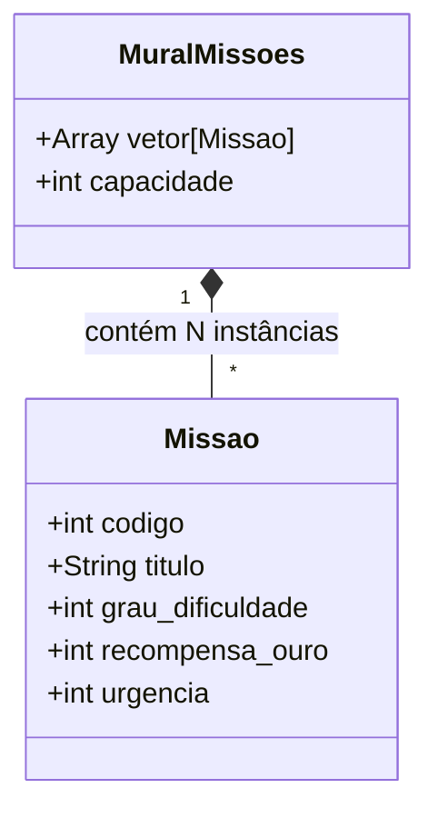
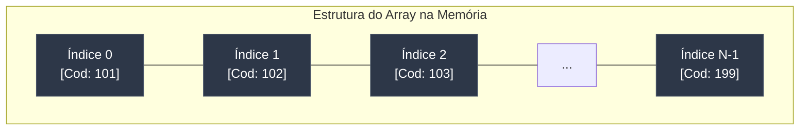
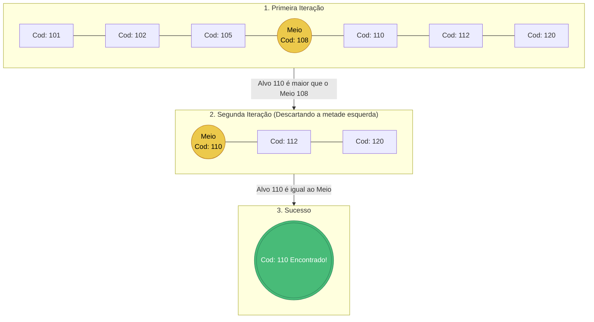
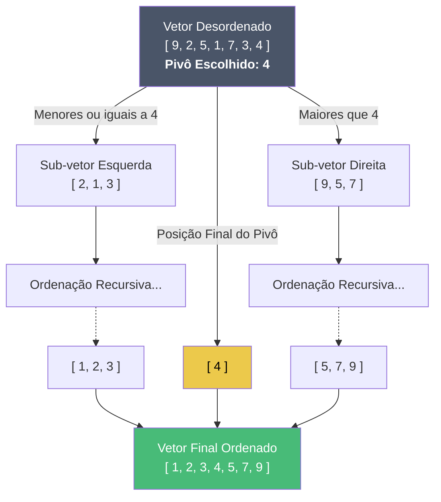

# Representação Visual - O Conselho de Missões (Guilda 4)

Você pode copiar e colar os diagramas abaixo diretamente no seu arquivo `Manual_do_Desenvolvedor.md` (o GitHub e muitos conversores de PDF suportam a linguagem "Mermaid"). Você também pode tirar *prints* da visualização para colocar nos seus Slides!

---

## 1. Representação Lógica do TAD (Modelagem e Memória)

Este diagrama mostra o relacionamento das classes e como os dados ficam dispostos fisicamente em blocos contíguos de memória (Vetor/Array), garantindo o acesso rápido $O(1)$ por índice.

**Visão do Vetor na Memória:**

---

## 2. Representação do Algoritmo: Busca Binária

Este fluxograma ilustra o princípio da divisão e conquista da Busca Binária ao procurar a Missão de Código **110**. Note que a pré-condição é que o vetor já esteja ordenado.

---

## 3. Representação do Algoritmo: Quick Sort

Este diagrama explica a estratégia de partição do algoritmo mais eficiente escolhido pelo grupo, utilizando um Pivô.

